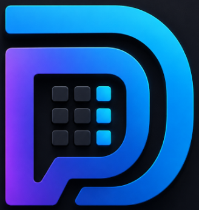
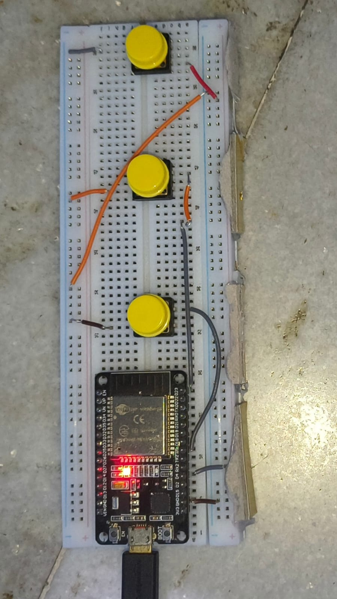
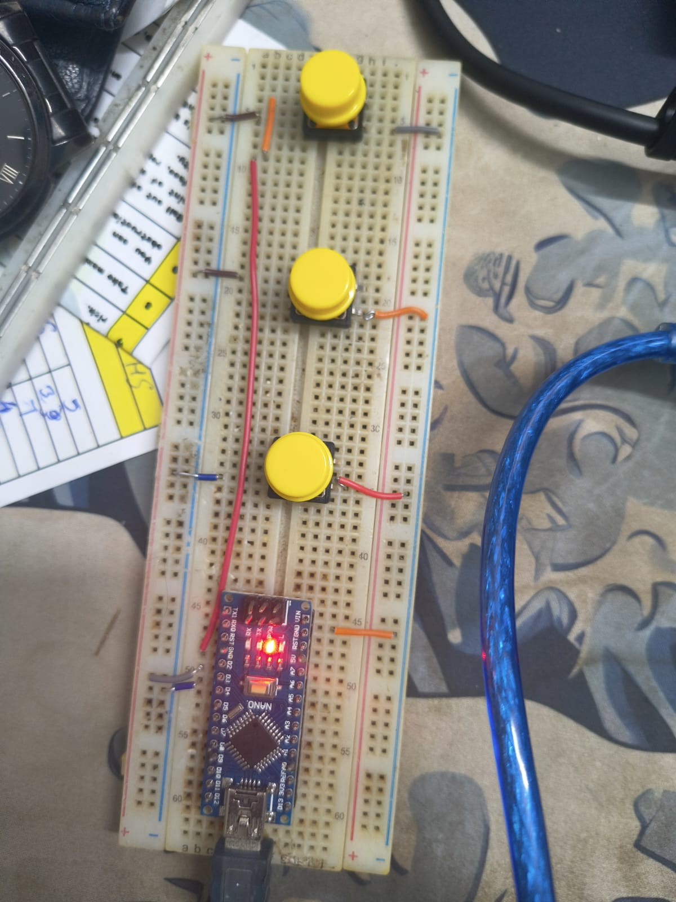
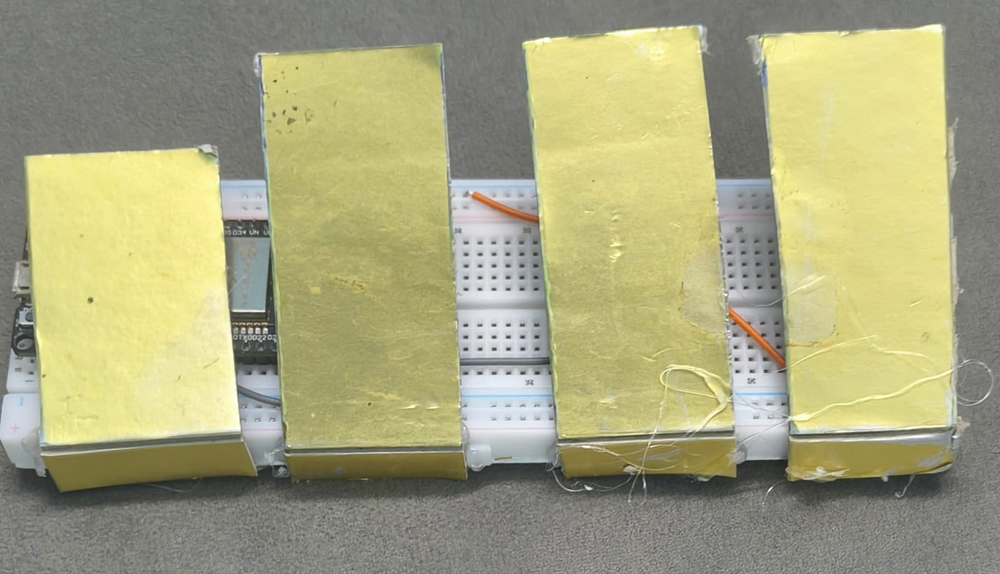
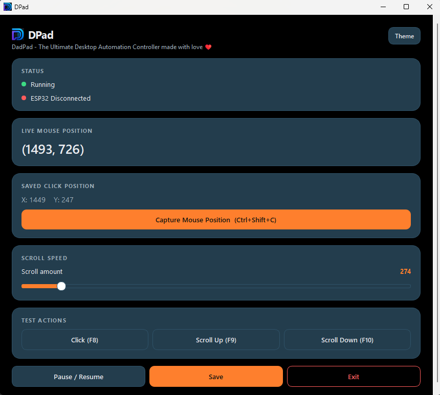

#  DPad

A minimalist, Stream-Deck-style desktop macro controller with a light/dark
theme picker, built-in test actions, and support for a physical ESP32
button pad that triggers clicks and scroll actions over serial.

---

## Screenshots

### Hardware

<p>
  
  
  
</p>

### Software

<p>
  
</p>

---

## Quick Start — Download and Run (no Python required)

1. Go to the repo: https://github.com/SivTheCoder/dpad
2. Click **`DPad.exe`** in the file list, then click **Download raw file**
   (or clone/download the whole repo as a ZIP and run `DPad.exe` from
   inside it).
3. Double-click `DPad.exe` to launch.
   - Windows SmartScreen may show **"Windows protected your PC"** the
     first time, since the exe isn't code-signed. Click **More info →
     Run anyway**.
4. That's it — DPad opens ready to use. No Python, no dependencies.

> If you just want to use the app (not edit the code), this is the only
> section you need.

---

## Run from Source (for development)

```bash
git clone https://github.com/SivTheCoder/dpad.git
cd dpad

python -m venv .venv
.venv\Scripts\activate        # Windows
# source .venv/bin/activate   # macOS/Linux

pip install -r requirements.txt
python main.py
```

## Rebuilding DPad.exe

The exe was built with PyInstaller using the included spec files. To
rebuild it after changing the code:

```bash
pyinstaller main.spec
```

The output appears in `dist/DPad.exe`. `DPad.spec` is kept as a
secondary/reference spec (e.g. from an earlier build configuration).

---

## Project Structure

```
dpad/
├── DPad.exe            # Ready-to-run Windows build
├── DPad.spec            # PyInstaller spec (reference)
├── main.spec              # PyInstaller spec (used for the current build)
├── main.py                 # Entry point — starts the app, ESP32 handler, and window
├── gui.py                   # UI: Stream-Deck-style panel, theme picker
├── actions.py                # Click / scroll-up / scroll-down macro actions
├── config.py                  # Load/save config.json
├── config.json                 # Saved settings (scroll amount, click position, etc.)
├── profile_manager.py           # Profile handling
├── serial_handler.py             # ESP32 serial connection + message parsing
├── logo.ico                       # App icon
├── assets/
│   └── screenshots/                 # README images (1–3 hardware, 4 & 6 software)
└── build/                          # PyInstaller build cache (not needed to run)
```

---

## ESP32 Companion Pad (Optional Hardware)

DPad can be triggered by three physical buttons wired to an ESP32,
which sends simple text commands over USB serial that `serial_handler.py`
listens for.

### What each button does

| Serial message      | Action in DPad           |
|----------------------|---------------------------|
| `ACTION_CLICK`        | Performs a click at the saved position |
| `ACTION_SCROLL_UP`     | Scrolls up |
| `ACTION_SCROLL_DOWN`    | Scrolls down |

### Wiring

Each button is wired between its signal pin and **GND**, using the
ESP32's internal pull-up resistor (`INPUT_PULLUP`) — so **no external
resistors are needed**. A press pulls the pin from `HIGH` to `LOW`.

| Button       | ESP32 Pin | Other leg  |
|---------------|-----------|------------|
| Click          | GPIO 2     | GND |
| Scroll Up       | GPIO 3      | GND |
| Scroll Down      | GPIO 4       | GND |

```
        ESP32
      ┌─────────┐
      │  GPIO 2 ●├────┐
      │  GPIO 3 ●├──┐ │      Each button:
      │  GPIO 4 ●├┐ │ │      one leg → GPIO pin
      │      GND ●┼┼─┼─┘     other leg → GND
      └──────────┘│ │
                   │ │
      [BTN_DOWN]───┘ │
      [BTN_UP]───────┘
      [BTN_CLICK]─────── (wired to GPIO 2 + GND)
```

If you're using a standard 2-pin tactile push button, it doesn't
matter which of its two legs goes to the GPIO pin vs. GND — momentary
buttons aren't polarized.

### Arduino IDE Setup

1. Install the **Arduino IDE** (2.x recommended): https://www.arduino.cc/en/software
2. Install ESP32 board support:
   - Open **File → Preferences**, and add this URL to *Additional
     Boards Manager URLs*:
     `https://raw.githubusercontent.com/espressif/arduino-esp32/gh-pages/package_esp32_index.json`
   - Open **Tools → Board → Boards Manager**, search "esp32", and
     install the **esp32 by Espressif Systems** package.
3. Connect your ESP32 via USB.
4. Select **Tools → Board** → your specific ESP32 board model.
5. Select **Tools → Port** → the COM port your ESP32 shows up on.
6. Paste in the sketch below, then click **Upload**.
7. Once uploaded, close the Arduino Serial Monitor if it's open —
   only one program can read the serial port at a time, and DPad
   needs it free to connect.

### Arduino Sketch

```cpp
const int BTN_CLICK = 2;
const int BTN_UP = 3;
const int BTN_DOWN = 4;
bool lastClick = HIGH;
bool lastUp = HIGH;
bool lastDown = HIGH;

void setup() {
  Serial.begin(115200);
  pinMode(BTN_CLICK, INPUT_PULLUP);
  pinMode(BTN_UP, INPUT_PULLUP);
  pinMode(BTN_DOWN, INPUT_PULLUP);
}

void loop() {
  bool click = digitalRead(BTN_CLICK);
  bool up = digitalRead(BTN_UP);
  bool down = digitalRead(BTN_DOWN);

  if (lastClick == HIGH && click == LOW) {
    Serial.println("ACTION_CLICK");
  }
  if (lastUp == HIGH && up == LOW) {
    Serial.println("ACTION_SCROLL_UP");
  }
  if (lastDown == HIGH && down == LOW) {
    Serial.println("ACTION_SCROLL_DOWN");
  }

  lastClick = click;
  lastUp = up;
  lastDown = down;
  delay(10);
}
```

**How it works:** each button is read every loop (with a 10ms delay
to lightly debounce). The `lastX == HIGH && x == LOW` check fires the
serial message only on the moment a button transitions from unpressed
to pressed (rising edge is `HIGH`, since the pin idles `HIGH` via the
pull-up and drops to `LOW` when pressed) — so holding a button down
doesn't spam repeated messages, one press sends one message.

### Connecting it in DPad

Once the sketch is uploaded and the Arduino Serial Monitor is closed,
launch `DPad.exe` (or `python main.py`). The **Status** card's ESP32
indicator should switch from *Disconnected* to *Connected (COMx)*
automatically once `serial_handler.py` finds the board. Pressing a
wired button will then trigger the same click/scroll action as the
matching **Test Actions** button in the app.

---

## License

MIT — see the license included in the repository.
